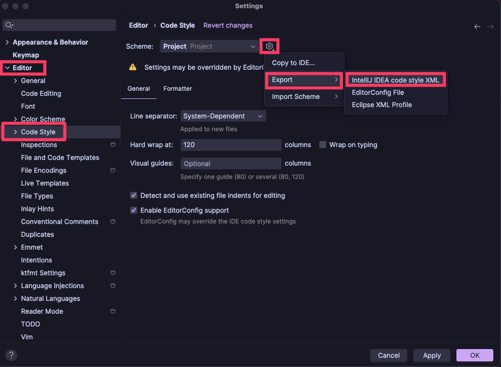

# Extracting Code Style from IntelliJ IDEA

## 1. Exporting Code Style Settings to a file
To export code style settings from IntelliJ IDEA to a file, go to
`Settings | Editor | Code Style` and click on the gear icon next to the scheme name.

## 2. Using IntelliJ's active code style directly
If you have your code style settings checked into version control (in your `.idea` directory), 
you can use the active code style directly in Spotless without exporting it to a file. 
The file can be found at `.idea/codeStyles/Project.xml`.

## Upstream documentation
More details can be found in the [IntelliJ IDEA documentation](https://www.jetbrains.com/help/idea/command-line-formatter.html#options)
for the command line formatter, which is what Spotless uses under the hood.
