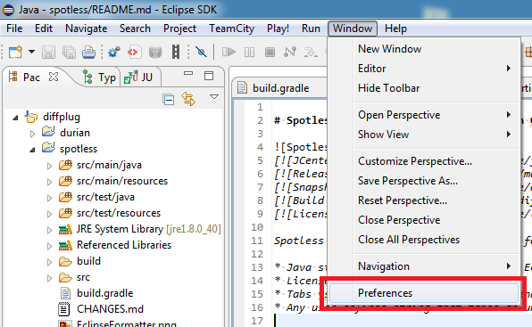

#  Spotless: Keep your code spotless with Gradle

<!---freshmark shields
output = [
	link(shield('Gradle plugin', 'plugins.gradle.org', 'com.diffplug.gradle.spotless', 'blue'), 'https://plugins.gradle.org/plugin/com.diffplug.gradle.spotless'),
	link(shield('Maven central', 'mavencentral', 'com.diffplug.gradle.spotless:spotless', 'blue'), 'http://search.maven.org/#search%7Cgav%7C1%7Cg%3A%22com.diffplug.gradle.spotless%22%20AND%20a%3A%22spotless%22'),
	link(shield('Javadoc', 'javadoc', '{{stable}}', 'blue'), 'https://{{org}}.github.io/{{name}}/javadoc/{{stable}}/'),
	'',
	link(shield('Changelog', 'changelog', '{{version}}', 'brightgreen'), 'CHANGES.md'),
	link(image('Travis CI', 'https://travis-ci.org/{{org}}/{{name}}.svg?branch=master'), 'https://travis-ci.org/{{org}}/{{name}}'),
	link(shield('Live chat', 'gitter', 'chat', 'brightgreen'), 'https://gitter.im/{{org}}/{{name}}'),
	link(shield('License Apache', 'license', 'apache', 'brightgreen'), 'https://tldrlegal.com/license/apache-license-2.0-(apache-2.0)')
	].join('\n');
-->
[](https://plugins.gradle.org/plugin/com.diffplug.gradle.spotless)
[](http://search.maven.org/#search%7Cgav%7C1%7Cg%3A%22com.diffplug.gradle.spotless%22%20AND%20a%3A%22spotless%22)
[](https://diffplug.github.io/spotless/javadoc/2.0.0/)

[](CHANGES.md)
[](https://travis-ci.org/diffplug/spotless)
[](https://gitter.im/diffplug/spotless)
[](https://tldrlegal.com/license/apache-license-2.0-(apache-2.0))
<!---freshmark /shields -->

<!---freshmark javadoc
output = prefixDelimiterReplace(input, 'https://{{org}}.github.io/{{name}}/javadoc/', '/', stable)
-->

Spotless is a general-purpose formatting plugin.  It is completely a-la-carte, but also includes powerful "batteries-included" if you opt-in.

To people who use your build, it looks like this:

```
cmd> gradlew build
...
:spotlessJavaCheck FAILED
> Format violations were found. Run 'gradlew spotlessApply' to fix them.
	src\test\java\com\diffplug\gradle\spotless\ResourceTest.java

cmd> gradlew spotlessApply
:spotlessApply
BUILD SUCCESSFUL

cmd> gradlew build
BUILD SUCCESSFUL
```

Inside your buildscript, it looks like this:

```groovy
spotless {
	format 'misc', {
		target '**/*.gradle', '**/*.md', '**/.gitignore'

		trimTrailingWhitespace()
		indentWithTabs() // or spaces. Takes an integer argument if you don't like 4
		endWithNewline()
	}
	format 'cpp', {
		target '**/*.hpp', '**/*.cpp'

		customReplace      'Not enough space after if', 'if(', 'if ('
		customReplaceRegex 'Too much space after if', 'if +\\(', 'if ('

		// Everything before the first #include or #pragma will
		// be replaced with whatever is in `spotless.license.cpp`
		licenseHeaderFile 'spotless.license.cpp', '#'
	}
}
```

Spotless can check and apply formatting to any plain-text file, using simple rules ([javadoc](https://diffplug.github.io/spotless/javadoc/2.0.0/com/diffplug/gradle/spotless/FormatExtension.html)) like those above.  It also supports more powerful formatters:

* Eclipse's java code formatter (including style and import ordering)
* [FreshMark](https://github.com/diffplug/freshmark) (markdown with variables)
* Any user-defined function which takes an unformatted string and outputs a formatted version.

Contributions are welcome, see [the contributing guide](CONTRIBUTING.md) for development info.

Spotless requires Gradle to be running on JRE 8+.  If you really want to run Gradle on 6 or 7 that could be done, see [issue #7](https://github.com/diffplug/spotless/issues/7) for details.

## Applying to Java source

```groovy
apply plugin: 'java'
...

spotless {
	java {
		// By default, all Java source sets will be formatted.  To change
		// this, set the 'target' parameter as described in the next section.

		licenseHeader '/* Licensed under Apache-2.0 */'	// License header
		licenseHeaderFile 'spotless.license.java'		// License header file
		// Obviously, you can't specify both licenseHeader and licenseHeaderFile at the same time

		importOrder ['java', 'javax', 'org', 'com', 'com.diffplug', '']	// An array of package names
		importOrderFile 'spotless.importorder'							// An import ordering file, exported from Eclipse
		// As before, you can't specify both importOrder and importOrderFile at the same time
		// You probably want an empty string at the end - all of the imports you didn't specify
		// explicitly will go there.

		eclipseFormatFile 'spotless.eclipseformat.xml'	// XML file dumped out by the Eclipse formatter
		// If you have an older Eclipse properties file, you can use that too.

		// You can also tweak the formatting with custom regexes or functions, such as:
		// Eclipse formatter screws up long literals with underscores inside of annotations (see issue #14)
		//    @Max(value = 9_999_999 L)	// what Eclipse does
		//    @Max(value = 9_999_999L)	// what I wish Eclipse did
		custom 'Long literal fix', { it.replaceAll('([0-9_]+) [Ll]', '$1L') }
	}
}
```

## Applying [FreshMark](https://github.com/diffplug/freshmark) to markdown files

To apply freshmark to all of the `.md` files in your project, with all of your project's properties available for templating, just use this snippet:

```groovy
spotless {
	freshmark {}
}
```

You can also specify properties manually.

```groovy
spotless {
	freshmark {
		target 'README.md', 'CONTRIBUTING.md'
		properties([lib: 'MyLib', author: 'Me'])
		trimTrailingWhitespace()
		indentWithTabs()
		endWithNewline()
	}
}
```

## Custom rules

Spotless is a generic system for specifying a sequence of steps which are applied to a set of files.

```groovy
spotless {
	// this will create two tasks: spotlessMiscCheck and spotlessMiscApply
	format 'misc', {
		// target determines which files this format will apply to
		// - if you pass a string or a list of strings, they will be treated
		//       as 'include' parameters to a fileTree in the root directory
		// - if you pass a FileCollection, it will pass through untouched
		//       e.g. project.files('build.gradle', 'settings.gradle')
		// - if you pass anything else, it will be sent to project.files(yourArg)
		target '**/*.gradle', '**/*.md', '**/.gitignore'

		// spotless has built-in rules for the most basic formatting tasks
		trimTrailingWhitespace()
		indentWithTabs() // or spaces. Takes an integer argument if you don't like 4
		endWithNewline()

		// you can also call out to your own function
		custom 'superFormatter', {
			// when writing a custom step, it will be helpful to know
			// how the formatting process works, which is as follows:

			// 1) Load each target file, and convert it to unix-style line endings ('\n')
			// 2) Pass its content through a series of steps, feeding the output of each step to the next
			// 3) Put the correct line endings back on, then either check or apply

			// each step receives a string as input, and should output
			// a formatted string as output.  Each step can trust that its
			// input will have unix newlines, and it must promise to output
			// only unix newlines.  Other than that, anything is fair game!
		}
	}

	// The default line ending mode, GIT_ATTRIBUTES, has the exact same line ending
	// behavior as git, including support for the eol property of .gitattributes,
	// and the core.eol configuration property.
	lineEndings 'GIT_ATTRIBUTES' 	// can also be WINDOWS, UNIX, or PLATFORM_NATIVE
}
```

See [`JavaExtension.java`](src/main/java/com/diffplug/gradle/spotless/java/JavaExtension.java?ts=4) if you'd like to see how a language-specific set of custom rules is implemented.  We'd love PR's which add support for other languages.

## Example configurations (from real-world projects)

Spotless is hosted on jcenter and at plugins.gradle.org. [Go here](https://plugins.gradle.org/plugin/com.diffplug.gradle.spotless) if you're not sure how to import the plugin.

* [JUnit 5](https://github.com/junit-team/junit-lambda/blob/151d52ffab07881de71a8396a9620f18072c65ec/build.gradle#L86-L101) (aka JUnit Lambda)
* [opentest4j](https://github.com/ota4j-team/opentest4j/blob/aab8c204be05609e9f76c2c964c3d6845cd0de14/build.gradle#L63-L80)
* [Durian](https://github.com/diffplug/durian) ([direct link to spotless section in its build.gradle](https://github.com/diffplug/durian/blob/v3.2.0/build.gradle#L65-L85))
* [DurianRx](https://github.com/diffplug/durian-rx) ([direct link to spotless section in its build.gradle](https://github.com/diffplug/durian-rx/blob/v1.1.0/build.gradle#L92-L113))
* [DurianSwt](https://github.com/diffplug/durian-swt) ([direct link to spotless section in its build.gradle](https://github.com/diffplug/durian-swt/blob/v1.3.0/build.gradle#L137-L158))
* [MatConsoleCtl](https://github.com/diffplug/matconsolectl) ([direct link to spotless section in its build.gradle](https://github.com/diffplug/matconsolectl/blob/v4.4.1/build.gradle#L169-L189))
* [MatFileRW](https://github.com/diffplug/matfilerw) ([direct link to spotless section in its build.gradle](https://github.com/diffplug/matfilerw/blob/v1.3.1/build.gradle#L129-L149))
* [Goomph](https://github.com/diffplug/goomph) ([direct link to spotless section in its build.gradle](https://github.com/diffplug/goomph/blob/v1.0.0/build.gradle#L78-L99))
* [FreshMark](https://github.com/diffplug/freshmark) ([direct link to spotless section in its build.gradle](https://github.com/diffplug/freshmark/blob/v1.3.0/build.gradle#L52-L73))
* [JScriptBox](https://github.com/diffplug/jscriptbox) ([direct link to spotless section in its build.gradle](https://github.com/diffplug/jscriptbox/blob/v3.0.0/build.gradle#L45-L65))
* (Your project here)

<!---freshmark /javadoc -->

## Acknowledgements

* Formatting by Eclipse 4.6
	+ Special thanks to [Mateusz Matela](https://waynebeaton.wordpress.com/2015/03/15/great-fixes-for-mars-winners-part-i/) for huge improvements to the eclipse code formatter!
* Forked from [gradle-format-plugin](https://github.com/youribonnaffe/gradle-format-plugin) by Youri Bonnaff??.
* Thanks to Gabor Bernat for improvements to logging and multi-project support.
* Import ordering from [EclipseCodeFormatter](https://github.com/krasa/EclipseCodeFormatter).
* Built by [gradle](http://gradle.org/).
* Tested by [junit](http://junit.org/).
* Maintained by [DiffPlug](http://www.diffplug.com/).

## Exporting / importing from Eclipse

There are two files to import / export with Eclipse - one for code formatting and one for import ordering.

### Opening the preferences


### Creating `spotless.eclipseformat.xml`


Eclipse formatter's off / on tags are a great feature which is often overlooked.


### Creating `spotless.importorder`

