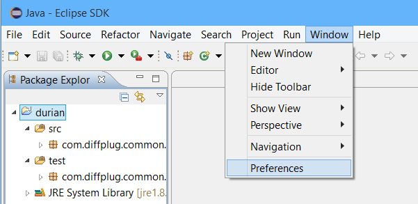
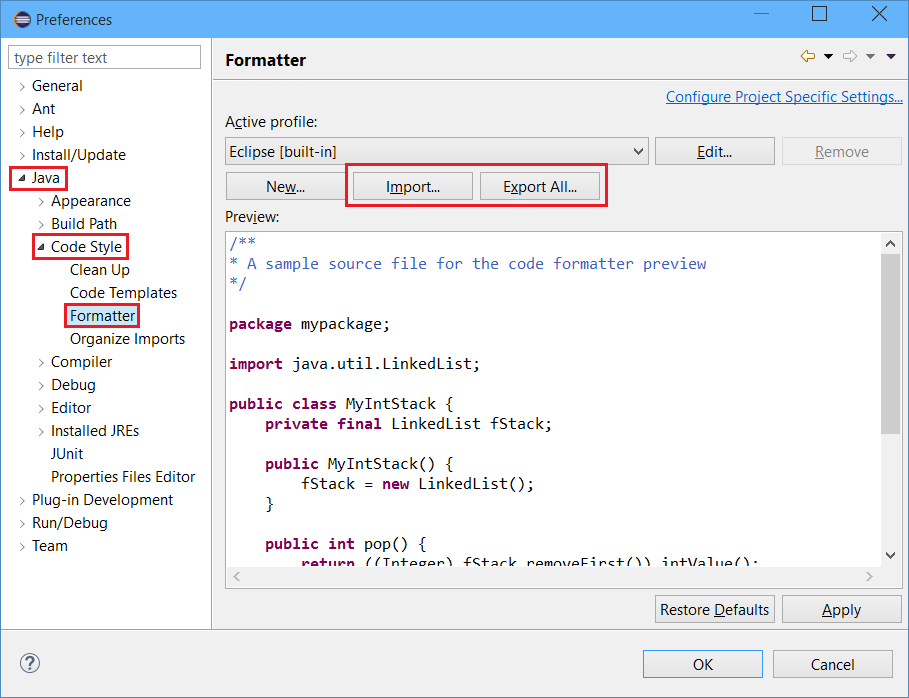
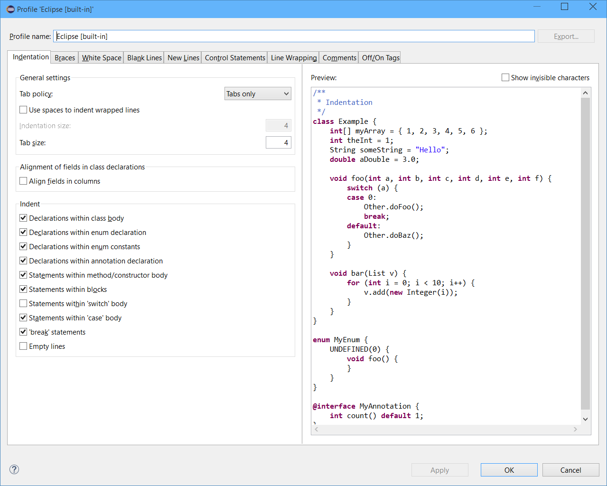
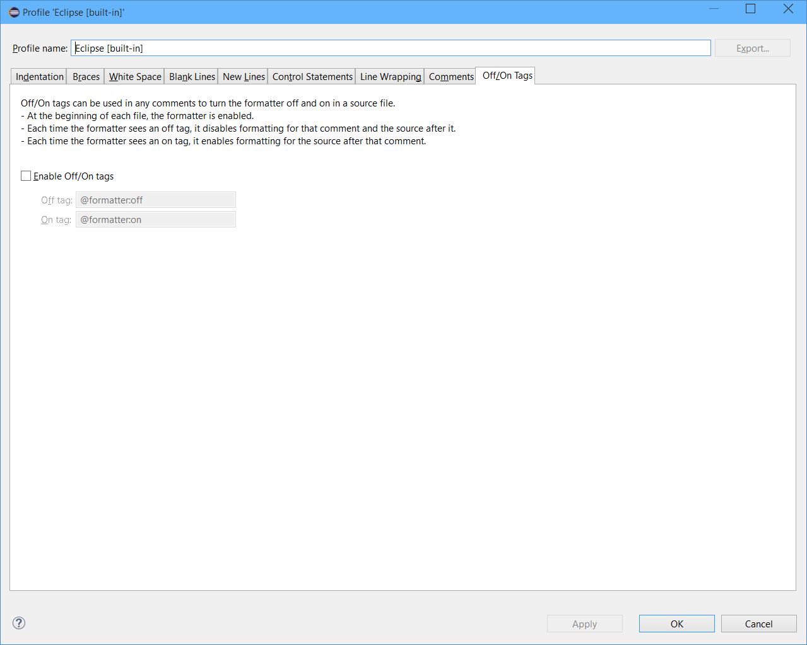
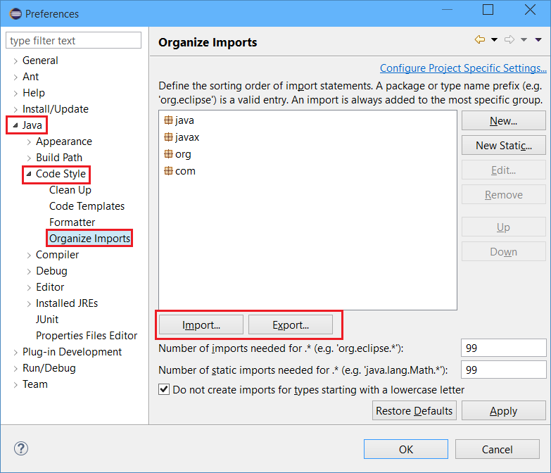

# Spotless: Keep your code spotless with Gradle

[](https://github.com/diffplug/spotless/releases/latest)
[](https://github.com/diffplug/spotless/tree/develop)
[](https://travis-ci.org/diffplug/spotless)
[](https://tldrlegal.com/license/apache-license-2.0-(apache-2.0))

# PREPPING FOR RELEASE - NOT YET READY FOR USE!

Spotless can check and apply formatting for any plain-text file, with special support for Java.  It supports several formatters out of the box, including:

* Java style enforcement (using Eclipse's code formatter)
* Java import ordering (using Eclipse's import ordering)
* license headers
* tabs vs spaces
* trailing whitespace
* generic regex
* Any user-defined string that takes an unformatted string and outputs a formatted version.

Even if you don't use Eclipse, or even Java, Spotless makes it painless to find and correct formatting errors:

```
cmd> gradlew build
   ...
:spotlessJavaCheck FAILED
> Format violations were found. Run 'gradlew spotlessApply' to fix them.
    src\test\java\com\diffplug\gradle\spotless\ResourceTest.java

cmd> gradlew spotlessApply
:spotlessApply
BUILD SUCCESSFUL

cmd> gradlew build
BUILD SUCCESSFUL
```

If you want to see what spotless will do to your code:
* Save your working tree with `git add -A`, then `git commit -m "Checkpoint before spotless."`.
* Run `gradlew spotlessApply`.
* View the changes with `git diff`.
* If you don't like what spotless did, `git reset --hard`.
* If you'd like to remove the "checkpoint" commit, `git reset --soft head~1` will make the checkpoint commit "disappear".  

## Adding spotless to your Java source

```groovy
buildscript {
	repositories {
		jcenter()
	}
	dependencies {
		classpath 'com.diffplug.gradle.spotless:spotless:1.0'
	}
}

apply plugin: 'java'
...

apply plugin: 'com.diffplug.gradle.spotless'
spotless {
	// If you'd like to specify that files should always have a certain line ending, you can,
	// but the default value of PLATFORM_NATIVE is highly recommended
	lineEndings = PLATFORM_NATIVE 	// can be WINDOWS, UNIX, or PLATFORM_NATIVE

	java {
		licenseHeader '/** Licensed under Apache-2.0 */'	// License header
		licenseHeaderFile 'spotless.license.java'			// License header file
		// Obviously, you can't specify both licenseHeader and licenseHeaderFile at the same time

		importOrder ['java', 'javax', 'org', 'com', 'com.diffplug']	// An array of package names
		importOrderFile 'spotless.importorder.properties'	// An import ordering file, exported from Eclipse
		// As before, you can't specify both importOrder and importOrderFile at the same time

		eclipseFormatFile 'spotless.eclipseformat.xml'	// XML file dumped out by the Eclipse formatter
		// If you have an older Eclipse properties file, you can use that too.
	}
}
```

## Adding spotless to your other source

Spotless has a generic system for specifying which transformations to apply to which files. This makes it easy to apply simple formatting rules (indentation, trailing whitespace, etc) to all of your source assets.

```groovy
spotless {
	// If you'd like to specify that files should always have a certain line ending, you can,
	// but the default value of PLATFORM_NATIVE is highly recommended
	lineEndings = PLATFORM_NATIVE 	// can be WINDOWS, UNIX, or PLATFORM_NATIVE

	// this will create two tasks: spotlessGradleCheck and spotlessGradleApply
	format 'gradle' {
		// target determines which files this format will apply to
		// - if you pass a string or a list of strings, they will be treated as 'include'
		//   parameters to a fileTree in the root directory
		// - if you pass a FileCollection, it will pass through untouched, e.g. project.files('blah')
		// - if you pass anything else, it will be sent to project.files(yourArg) 
		target '**/*.gradle'

		// the formatting process is as follows:
		// 1) Load each target file, and convert it to unix-style line endings ('\n')
		// 2) Pass its content through a series of steps, feeding the output of each to the next

		// For a complete listing of the built-in steps, and mechanisms for building your own,
		// take a look at com.diffplug.gradle.spotless.FormatExtension
		indentWithTabs
		trimTrailingWhitespace
	}

	format 'cpp' {
		target ['**/*.hpp', '**/*.cpp']
		indentWithTabs
		trimTrailingWhitespace
		customReplace 'Space after if', 'if(', 'if ('
		// everything before the first #include or #pragma is the header
		licenseHeaderFile 'spotless.license.cpp', '#'
	}
}
```

## Exporting / importing from Eclipse

There are two files to import / export with Eclipse - the import ordering file and the code formatting file.

### Opening the preferences


### Creating `spotless.eclipseformat.xml`



Eclipse formatter's off / on tags are often overlooked:


### Creating `spotless.importorder.properties`


## Acknowledgements

* Formatting by Eclipse 4.5 M6
    + Special thanks to [Mateusz Matela](https://waynebeaton.wordpress.com/2015/03/15/great-fixes-for-mars-winners-part-i/) for huge improvements to the eclipse code formatter!
* Forked from [gradle-license-plugin](https://github.com/youribonnaffe/gradle-format-plugin) by Youri Bonnaffé.
* Import ordering from [EclipseCodeFormatter](https://github.com/krasa/EclipseCodeFormatter).
* Formatted by [spotless](https://github.com/diffplug/spotless).
* Built by [gradle](http://gradle.org/).
* Tested by [junit](http://junit.org/).
* Artifacts hosted by [jcenter](https://bintray.com/bintray/jcenter) and uploaded by [gradle-bintray-plugin](https://github.com/bintray/gradle-bintray-plugin).
